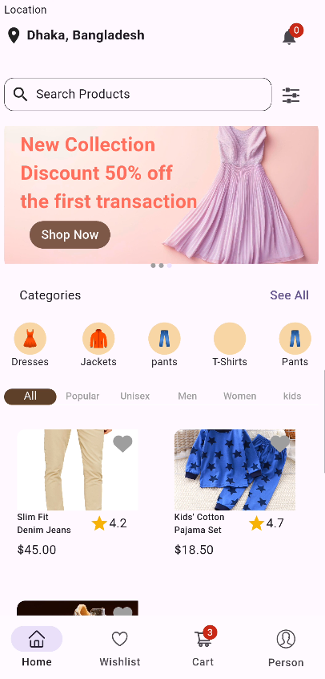
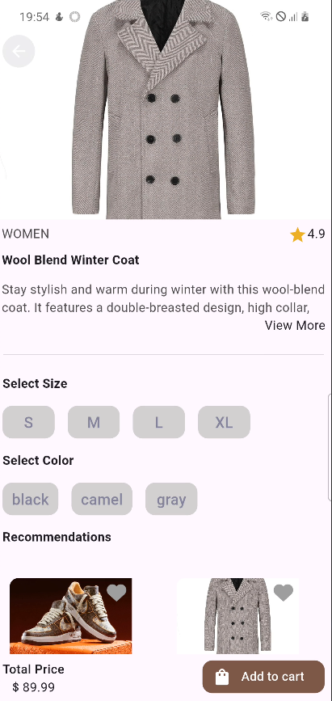
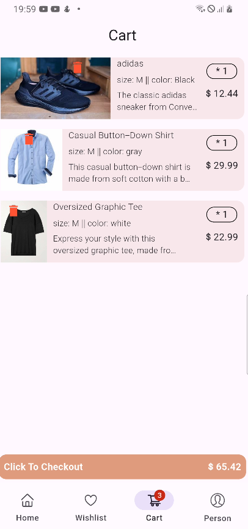
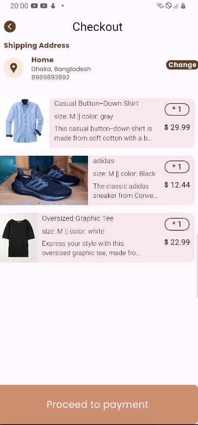
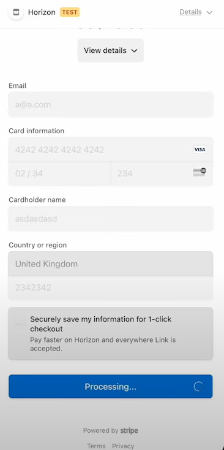
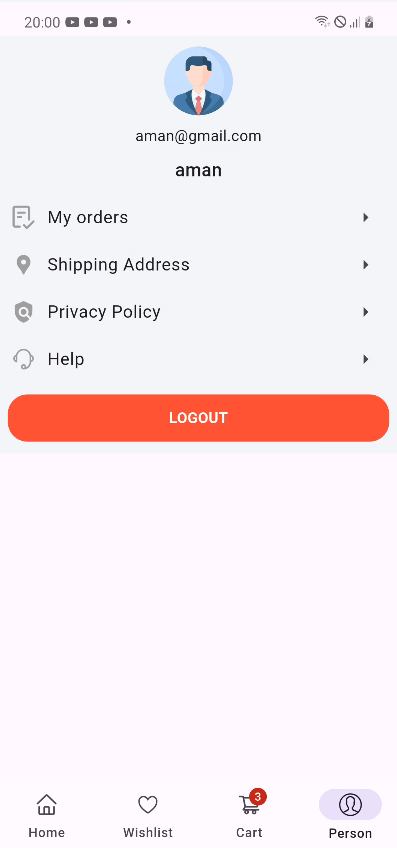

# FashionApp 👗🛒  

Alhamdulillah, this is a simple **E-commerce Fashion App** built using **Flutter** (frontend), **Django** (backend), **Stripe** (payment integration), and hosted via **Ngrok** for backend tunneling.  

The app allows users to browse products, view details, manage cart and wishlist, checkout securely, and make payments with Stripe.  

---

## ✨ Features  
- 🏠 Home screen with product listing  
- 👕 Product details page  
- ❤️ Wishlist functionality  
- 🛒 Add to Cart & manage cart items  
- 💳 Secure checkout with Stripe  
- ✅ Order success confirmation  
- 👤 User profile page  

---

## 🛠️ Tech Stack  
- **Frontend:** Flutter  
- **Backend:** Django  
- **Hosting:** Ngrok  
- **Payment Gateway:** Stripe  

---
## 📸 Screenshots  

**Home**  
  

**Product Details**  
  

**Wishlist**  
  

**Cart**  
  

**Checkout**  
  

**Stripe Payment**  
  

**Success**  
  

**Profile**  
  
